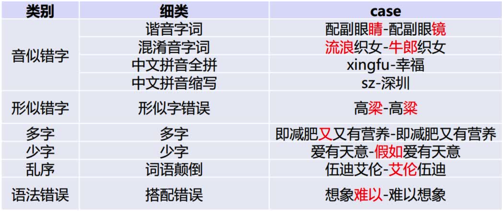
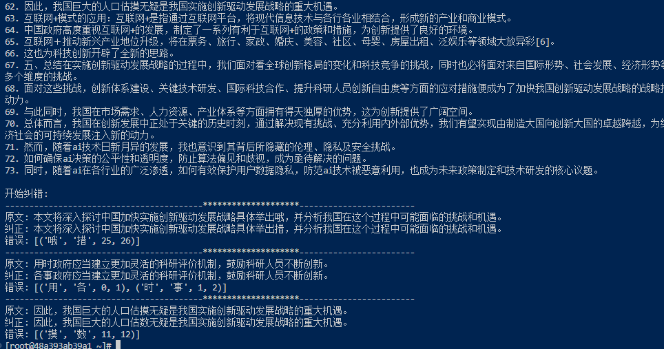

# introduction

本项目借助开源工具[pycorrector](https://github.com/shibing624/pycorrector)和开源模型[spaCy](https://github.com/explosion/spaCy)实现了一个长文本的自动分句+纠错，其中分句采用spaCy中文模型zh_core_web_sm处理，而纠错则采用pycorrector提供的预训练好的MacBERT4CSC模型。

该项目能够进行的中文文本纠错类型如下（图片出自pycorrector)：

​	

# Usage

首先确保你已经安装了[docker](https://www.docker.com/)

随后打开命令行运行

```
docker run -dit howillmakeit/cncorrector:v1
```

打开vscode，安装Dev Containers插件，随后按F1，输入：

```
Dev containers: Attach to Running container
```

选择正在运行的容器，打开root文件夹，随后就可以在左侧看到test.py文件，文件中包含了一个我的测试案例（我的习概论文），可以直接运行检查是否缺少环境。

在cncorrector.py文件中，将long_text字符串的值替换为你的待检测文本即可运行。

如果你的文本已经做好了分句，也可以直接替换error_sentences字符串的值，注意格式类似：

```python
error_sentences = [
        '真麻烦你了。希望你们好好的跳无',
        '少先队员因该为老人让坐',
    ]
```

# 使用示例

本项目的优势在于开盖即用，适合懒得折腾的朋友。

对于专业性较高的文本，例如计算机网络课本，纠错效果一般

**适用于平时的小论文/演讲稿的纠错**

例如我将我大一写的习概论文（大约3000字）直接喂给模型，得到的输出如下：



可以看到其将文本分为73个句子并检测出了4个错误。

第一个错误是打字的时候多打了一个“哦”。

第二个错误是“用时政府”，我也不知道为什么我会写这几个字（可能也是打快了）。

第三个错误是我将“规模”打成了“估模”，虽然模型未能正确纠错，但是成功地发现了错误。

